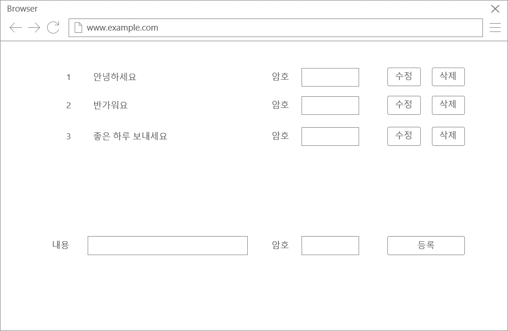

# MadApp Coding Test

아래의 코딩 테스트 목록 중 하나를 선택하여 풀어보세요.  
제출 방법은 이 레포지터리에 Pull Request를 보내는 형식으로 제출합니다.  
개발 언어나 구현 방법은 자유이며 대면 면접 시 왜 그런 방식으로 개발했는지 설명할 수 있으면 됩니다.

## 테스트 목록
1. CRUD를 활용한 간단한 게시판
2. http call을 통한 ERC-721 배포, 조회
3. 문자열 정렬

---


## 1. CRUD를 활용한 간단한 게시판

### 개발 목표

  * 게시글을 쓰고 지울 수 있는 간단한 게시판을 구현하시오. 아래 첨부한 UI를 참고하되 반드시 동일할 필요는 없습니다. 대부분의 게시판이 따르는 UX/UI이면 됩니다.

### 개발 내용

   * 게시판 UI
   * CRUD API
   * 데이터베이스

### 참고 UI


---

## 2. http call을 통한 ERC-721 배포, 조회

### 개발 목표

   * ERC-721 스마트컨트랙트를 배포하고 이를 조회 할 수 있는 API를 만든다. 아래의 컨트랙트 배포 기능과 컨트랙트 조회 기능의 입/출력 조건을 보고 이를 수행할 수 있는 스마트컨트랙트와 POST API와 GET API를 구현하시오.

### 개발 내용

   * ERC-721 스마트 컨트랙트 구현
   * 컨트랙트 배포 기능 (POST API)
   * 컨트랙트 조회 기능 (GET API)

#### 컨트랙트 배포 기능

   * 입력 조건

       ```http
       POST http://host:port/erc721/deploy
       Body
       {
           "name": "ERC-721",
           "symbol": "ERC-721",
           "owner": "0x0000000000000000000000000000000000000000"
       }
       ```
   * 출력 조건
       ```json
       200 OK
       {
           "contractAddress": "0x0000000000000000000000000000000000000000",
           "transactionHash": "0x0000000000000000000000000000000000000000"
       }
       ```
#### 컨트랙트 조회 기능

   * 입력 조건
       ```http
       GET http://host:port/:contractAddress/erc721/balanceOf/:owner
       ```
   * 출력 조건

       ```json
       200 OK
       {
           "balance": 0 
       }
       ```

---

## 3. 문자열 정렬

### 개발 목표

  * 가장 기본적인 내용으로 프로그래밍 언어 숙련도를 확인하기 위해 제출합니다.

### 개발 내용

   * 입력은 알파벳 대문자로 제한
   * 예 : MADAPP -> AADMPP
